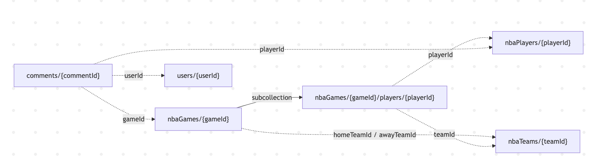

# API and Database Reference

This document describes the external NBA data endpoints used by the system and the Firestore data structures created during the data ingestion process.

This reference is intended for developers maintaining or extending backend services and frontend features that rely on NBA game and player data.

---

# 1. Overview

The NBA ingestion service retrieves game and player data from the **SportsDataIO API** and writes structured documents to **Firestore**.

## Data Flow

```text
SportsDataIO API
      ↓
Python ingestion script
      ↓
Firestore database
      ↓
Frontend application
```

## Authentication Requirements

The system requires the following credentials:

- `SPORTSDATAIO_KEY` environment variable
- Firebase service account key file
- Firestore access permissions

---

# 2. External API Endpoints

## 2.1 Get Daily Game Scores

### Endpoint

```http
GET https://api.sportsdata.io/v3/nba/scores/json/ScoresBasic/{DATE}?key={API_KEY}
```

### Purpose

Returns NBA games for a specific date, including game status and scores.

### Path Parameter

`{DATE}` format:

```
YYYY-MMM-DD
```

Example:

```
2026-MAR-01
```

### Example Request

```http
GET /v3/nba/scores/json/ScoresBasic/2026-MAR-01?key=YOUR_KEY
```

### Usage in Application

For each returned game:

```
Firestore document:
nbaGames/{gameId}
```

---

## 2.2 Get Final Box Scores (Player Statistics)

### Endpoint

```http
GET https://api.sportsdata.io/v3/nba/stats/json/BoxScoresFinal/{DATE}?key={API_KEY}
```

### Purpose

Returns finalized player statistics for games on a specific date.

### Path Parameter

```
{DATE} → YYYY-MMM-DD
```

### Example Request

```http
GET /v3/nba/stats/json/BoxScoresFinal/2026-MAR-01?key=YOUR_KEY
```

### Usage in Application

Player statistics are written to:

```
nbaGames/{gameId}/players/{playerId}
```

This `players` collection is a **subcollection inside each game document**.

---

# API Authentication Errors

## 401 / 403 Errors

Possible causes:

- Invalid API key
- API key permission problems
- Insufficient SportsDataIO subscription level

### Resolution

- Verify that the API key is valid
- Confirm the subscription plan allows this endpoint
- Ensure the key is correctly set in the environment variables

---

# 3. Firestore Database Structure

The application stores sports data using several top-level collections in Firestore.

The main collections are:

```
nbaGames
nbaTeams
nbaPlayers
users
comments
```

Only one nested collection exists:

```
nbaGames/{gameId}/players
```

---

## 3.1 Firestore Structure Diagram

The following diagram shows how the collections and IDs connect in the system.



*Figure: Firestore collection relationships used in the Sport Comment Web Application.*

---

## 3.2 Main Collections

### nbaGames

Each document represents a single NBA game.

```
nbaGames/{gameId}

awayScore
awayTeam
awayTeamId
date
homeScore
homeTeam
homeTeamId
status
lastUpdated
```

---

### nbaGames/{gameId}/players (Subcollection)

This subcollection stores **player statistics for a specific game**.

```
nbaGames/{gameId}/players/{playerId}

playerId
name
team
teamId
position
points
rebounds
assists
steals
blocks
turnovers
minutes
fantasyPoints
lastUpdated
```

These records represent **game-specific stats**, not permanent player information.

---

### nbaPlayers

Stores permanent player information.

```
nbaPlayers/{playerId}

id
firstName
lastName
name
headshot
headshotNoBg
```

---

### nbaTeams

Stores team information.

```
nbaTeams/{teamId}

teamId
abbr
fullName
slug
league
logo
primaryColor
secondaryColor
lastUpdated
```

---

## 3.3 How Records Connect

The system links collections using shared IDs instead of nested documents.

### Team Lookup

Games contain:

```
homeTeamId
awayTeamId
```

These IDs are used to retrieve the correct teams from:

```
nbaTeams/{teamId}
```

---

### Player Lookup

Game player statistics contain:

```
playerId
teamId
```

These values allow the system to retrieve the correct records from:

```
nbaPlayers/{playerId}
nbaTeams/{teamId}
```

---

## 3.4 Example Data Navigation

Example workflow when loading a game page:

1. Retrieve the game document

```
nbaGames/{gameId}
```

2. Use `homeTeamId` and `awayTeamId` to retrieve teams

```
nbaTeams/{teamId}
```

3. Retrieve player stats for that game

```
nbaGames/{gameId}/players/{playerId}
```

4. Use `playerId` to retrieve full player information

```
nbaPlayers/{playerId}
```

This design keeps collections independent while allowing the application to link records using IDs.

---

## What This Enables

This data model allows the system to:

- Retrieve teams for a specific game
- Retrieve players who participated in that game
- Load permanent player information
- Store game-specific player statistics
- Connect user comments to players and games
