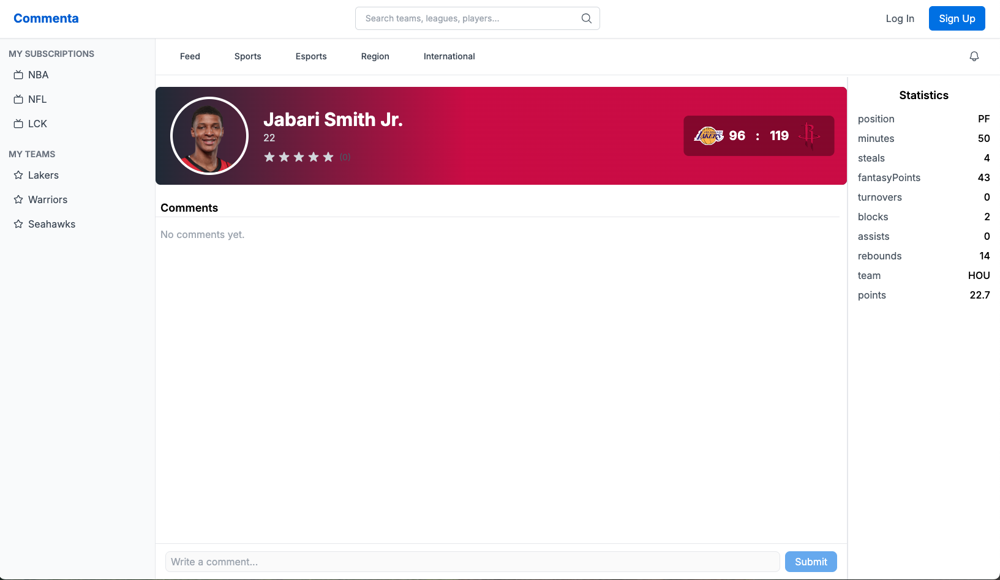

# Find Events and View Comments

## Purpose

Each sports event has its own discussion area. Finding the correct event or player helps keep discussions organized.

## Steps

1. From the homepage, use the sidebar to browse games from a sports league such as **NBA** or **NFL**.
2. You can also use the search bar at the top of the page to search for a team or league.
3. Click the team or league you want to explore.
4. Select a finished game to view available player statistics.
5. Click a player to open that player’s page and view comments for that game.

If you are on a comment page and want to return to the player page, look for the **game badge and score panel at the top of the page**.  
Click the area showing the **team names and score** to navigate back.

*Figure: The score and team panel can be clicked to return from the comment page to the player page.*

## Results

After completing these steps:

- The player page displays comments and statistics for that player in the selected game
- The page shows the player name, team, and related game context
